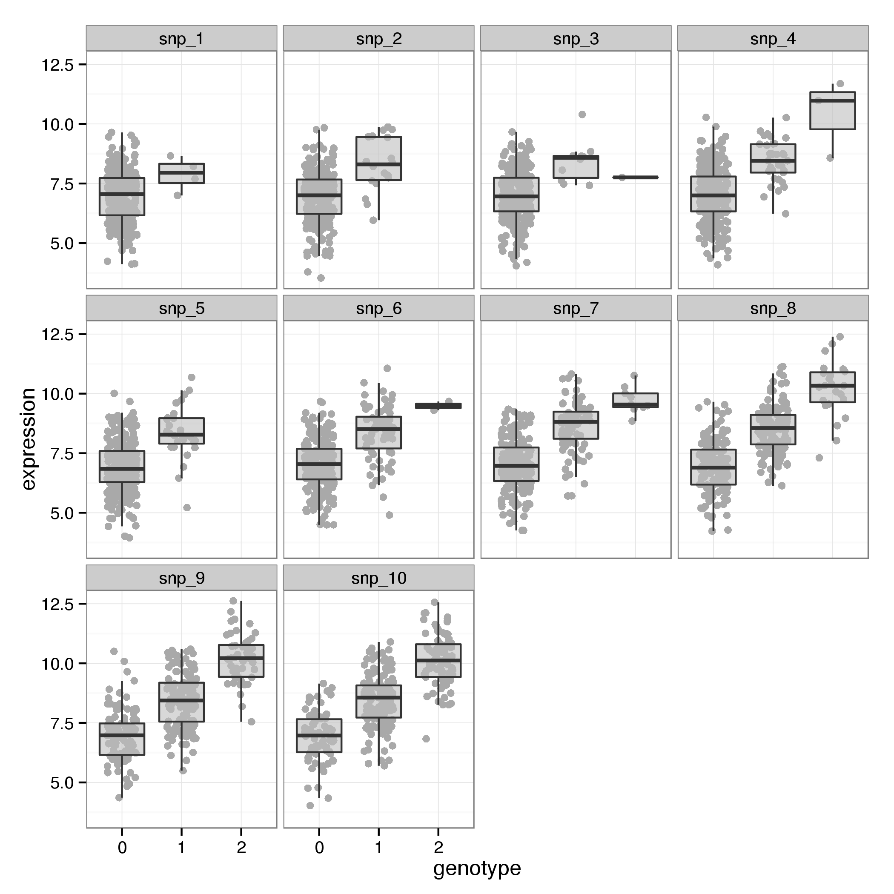
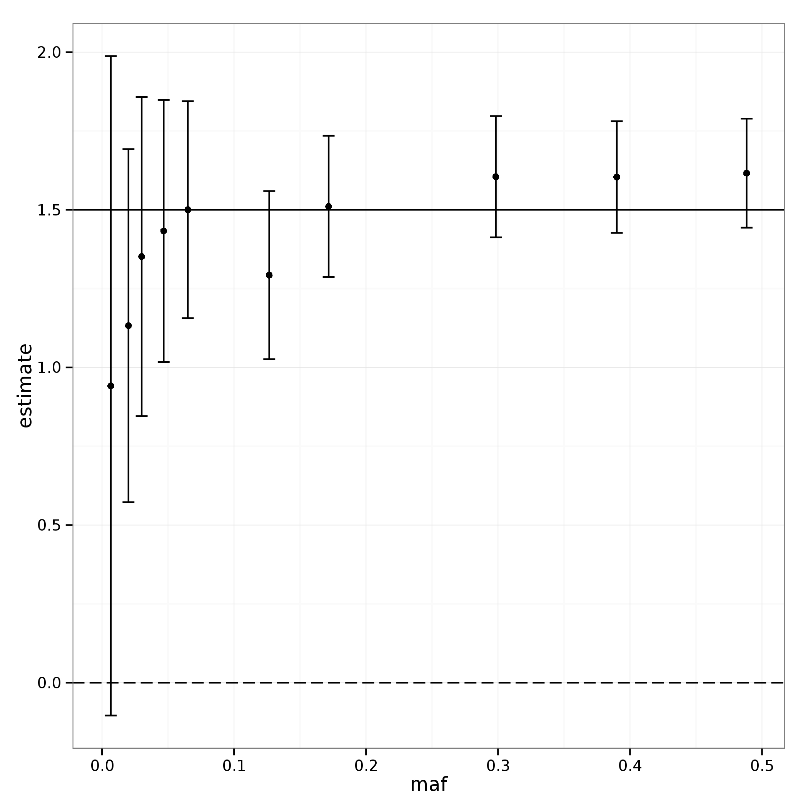
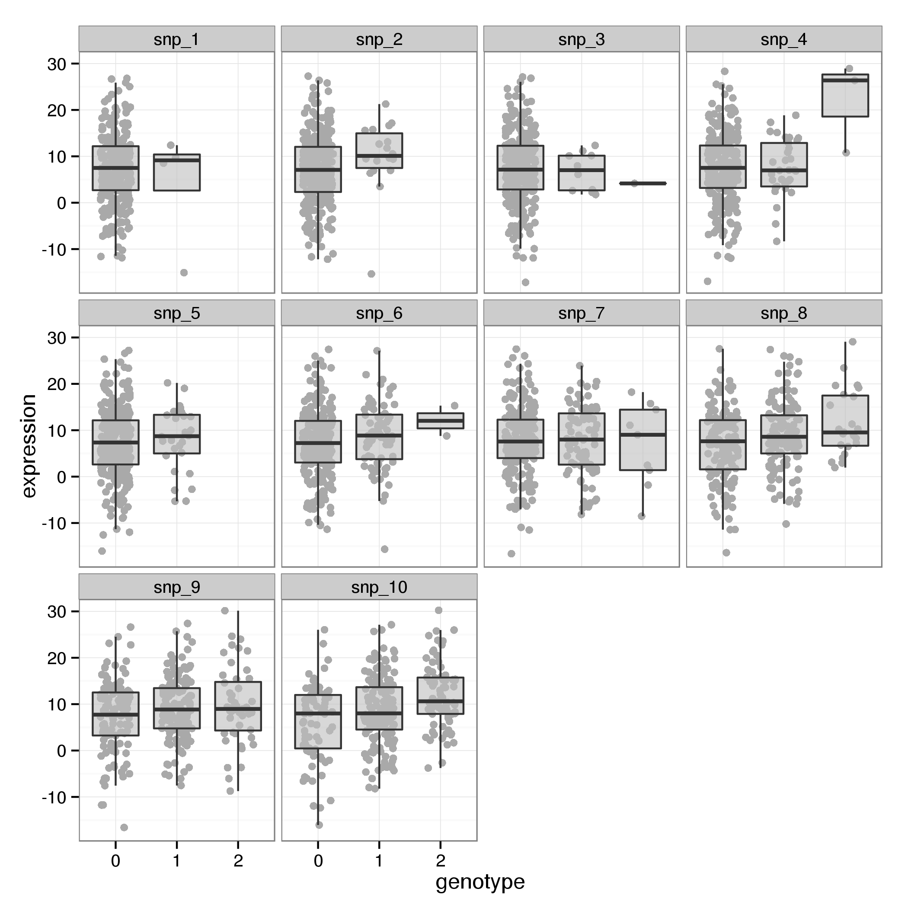
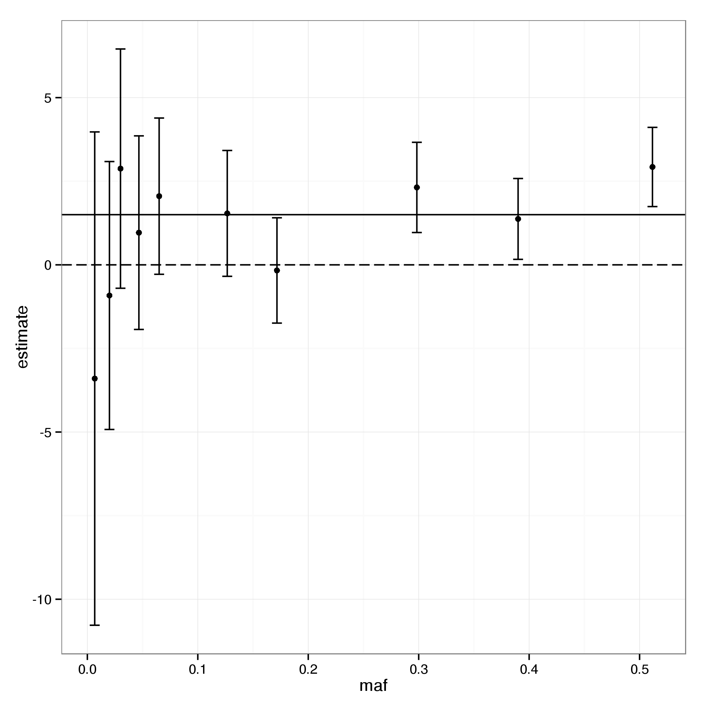
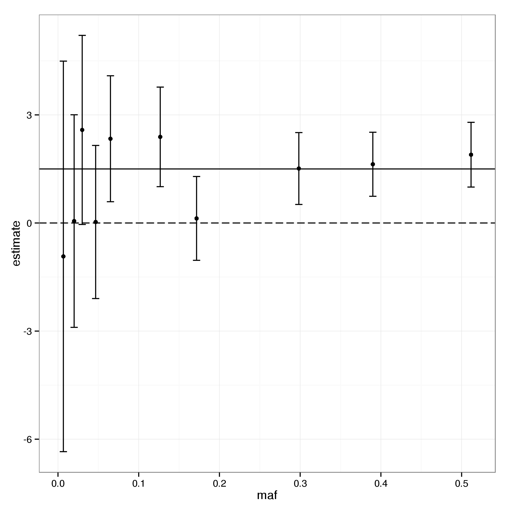
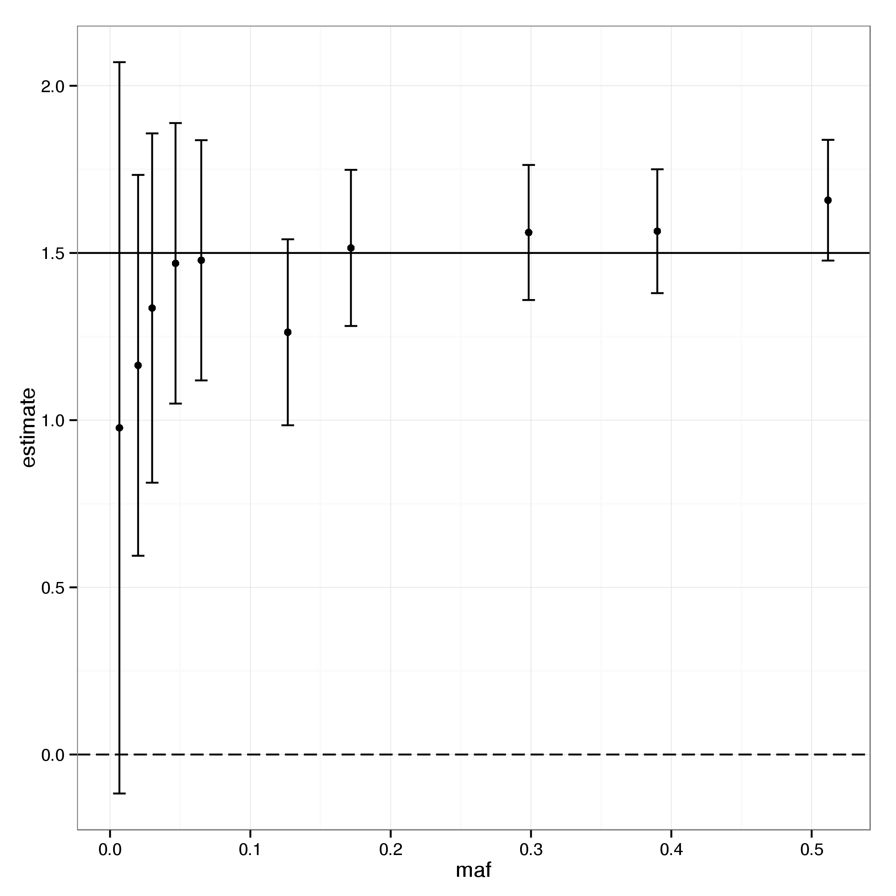
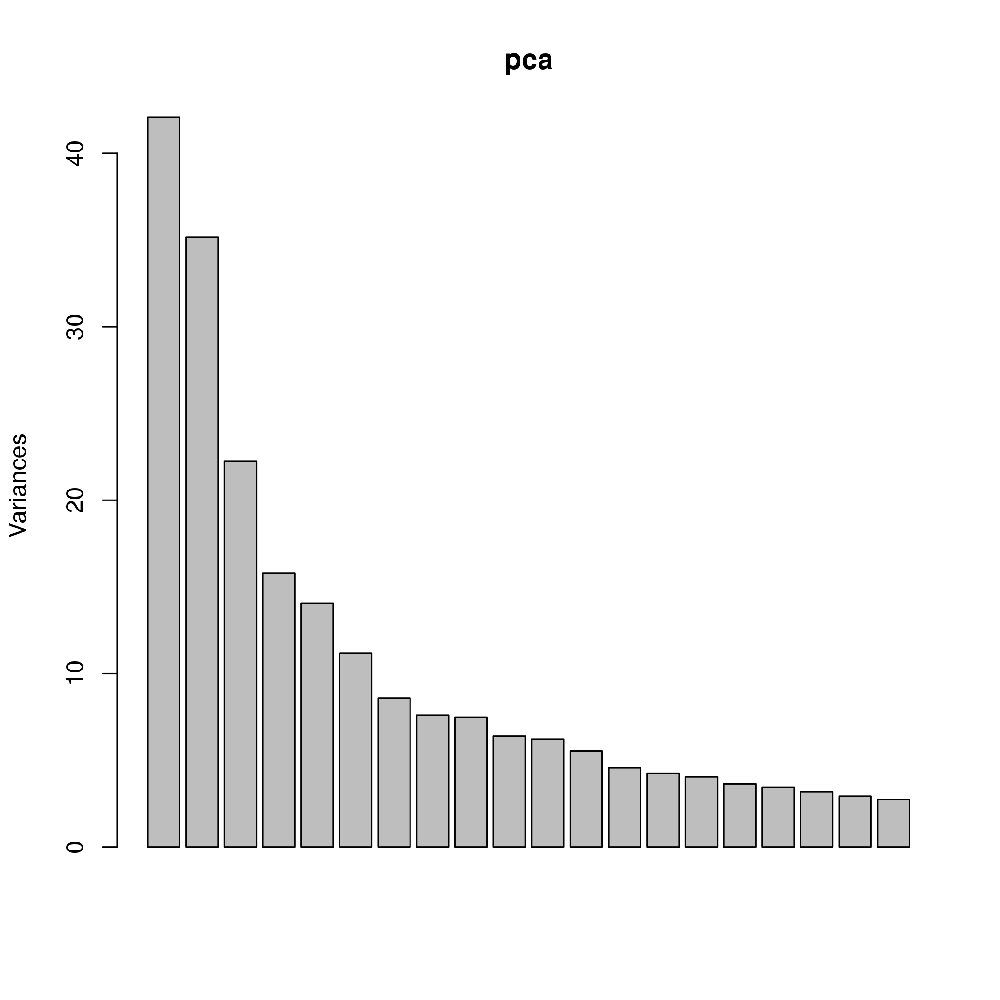
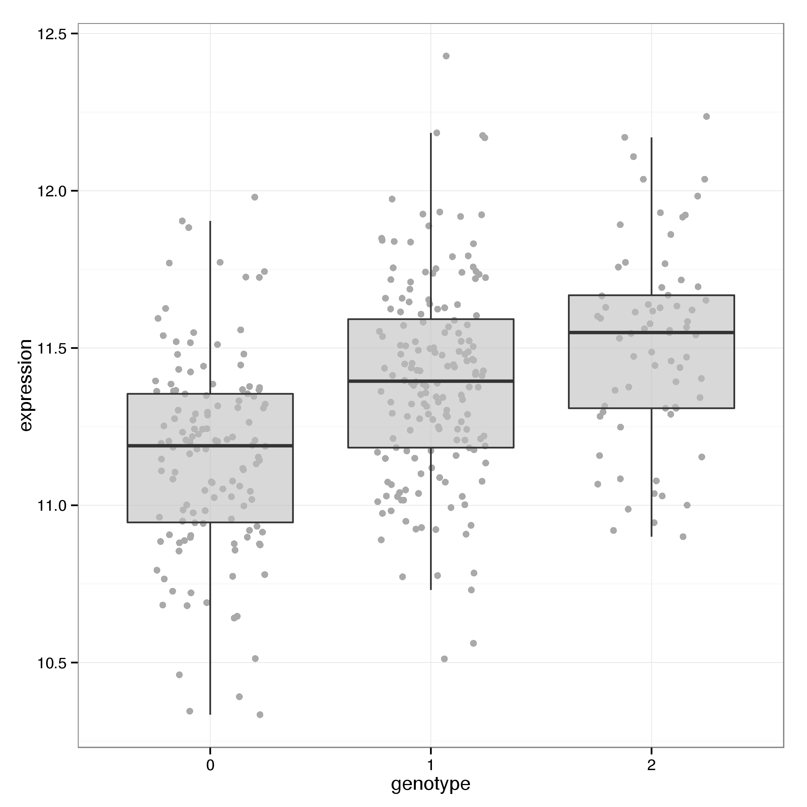

# Prerequisites {-}
## Using the Docker image
All exercises assume the use of the docker container `humburg/eqtl-intro`
to provide the required data as well as the necessary software environment.
This requires a working Docker installation^[installation instructions are available
from the [Docker website](https://docs.docker.com/installation/).].
The docker image can be obtained from DockerHub via

```sh
docker pull humburg/eqtl-intro
```
To run the RStudio server run

```sh
docker run -p 8787:8787 humburg/eqtl-intro
```
RStudio is then accessible at `localhost:8787` or, when using
[boot2docker](http://boot2docker.io/) via the IP address indicated 
by `boot2docker ip`.

## Included data
The image includes a number of simulated and real data sets used for these 
exercises. All data are provided as tab-separated files (typically with a column header).
Files are located in directories below `/data`. All simulated data are located in
`/data/simulated`. Real data can be found in `/data/genotyping`, `/data/expression`
and `/data/annotation` for genotyping, gene expression and annotation data 
respectively.


# Associations between SNPs and gene expression - A simple example {.exercise}
We will investigate the properties of a small simulated data set 
consisting of genotypes for 10 SNPs and expression values for 10 genes
from 300 individuals. Genotypes are encoded as 0, 1, and 2, indicating 
the number of copies of the second allele.

Genotypes are located in the file `/data/simulated/sim_genotypes.tab` and
gene expression values can be found in `/data/simulated/expression1.tab`.

## Questions

#. What are the minor allele frequencies of the different SNPs in the data set?
#. Consider pairs of SNPs and genes such that *snp_1* is paired with *gene_1*,
*snp_2* with *gene_2* and so on.
	i. Create a plot showing gene expression by genotype for one of the SNP/gene pairs.
    ii. For each SNP/gene pair fit a linear regression model to obtain an 
      estimate of the genotype effect on gene expression and compute the
      95% confidence intervals for the ten SNP effects.
    iii. Create a plot to compare the estimated coefficients and their 95% confidence
      intervals to 1.5, the true value of $\beta$. What do you observe?


# Solution for *Associations between SNPs and gene expression - A simple example* {.solution}
We start by loading the data. This can be done using RStudio's data import
functionality or manually through the command-line. 
 

```r
geno <- readr::read_tsv("/data/simulated/sim_genotypes.tab")
expr <- readr::read_tsv("/data/simulated/sim_expression1.tab")
```
Note that the first column contains the sample names.

## Computing minor allele frequencies
The genotypes are encoded as the number of copies of the second allele
carried by each individual. For eQTL analyses it is useful to ensure the
second allele corresponds to the minor allele. This helps with the interpretation
of genotype effects obtained from the analysis. In this case alleles have already
been arranged in a suitable manner^[at least for the most part, see below].

With the given encoding it is straightforward to obtain the frequency of
the second allele.


```r
maf <- colMeans(geno[-1])/2
maf
```

```
##       snp_1       snp_2       snp_3       snp_4       snp_5       snp_6 
## 0.006666667 0.030000000 0.020000000 0.065000000 0.046666667 0.126666667 
##       snp_7       snp_8       snp_9      snp_10 
## 0.171666667 0.298333333 0.390000000 0.511666667
```
As it turns out the second allele for *snp_10* is actually the major allele.
To ensure we actually get the MAF this needs to be inverted.


```r
maf <- pmin(maf, 1-maf)
maf
```

```
##       snp_1       snp_2       snp_3       snp_4       snp_5       snp_6 
## 0.006666667 0.030000000 0.020000000 0.065000000 0.046666667 0.126666667 
##       snp_7       snp_8       snp_9      snp_10 
## 0.171666667 0.298333333 0.390000000 0.488333333
```

## Plotting gene expression by genotype
A convenient way to display gene expression values by genotype is as box plots.
These provide a good, non-parametric, indication of the distributions.
To convey a sense of the frequency of each genotype in the sample it
is useful to also add points for each individual to the plot. 
Below is an example of how this might look for each of the ten SNP/gene pairs.


```r
library(ggplot2)
```

```
## Loading required package: methods
```

```r
genoLong <- tidyr::gather(geno, snp, genotype, -sample)
exprLong <- tidyr::gather(expr, gene, expression, -sample)
dataLong <- cbind(genoLong, exprLong["expression"])
dataLong$genotype <- as.factor(dataLong$genotype) 
ggplot(dataLong, aes(genotype, expression)) +
		geom_jitter(colour="darkgrey", position=position_jitter(width=0.25)) +
		geom_boxplot(outlier.size=0, alpha=0.6, fill="grey") + 
		facet_wrap(~snp) + theme_bw()
```

 

## Estimating SNP effects
To obtain estimates of the genotypic contribution to gene expression
we fit a simple linear regression model of the form $E_i = \beta_0 + \beta G_i + \varepsilon$,
where $E_i$ is the vector of gene expression values for gene $i$ and 
$G_i$ is the genotype vector for SNP $i$. We are interested in the estimate for
$\beta$ which indicates the change in gene expression for each copy of the second
allele.


```r
fit <- mapply(function(e, g) lm(e ~ g), expr[-1], geno[-1], SIMPLIFY=FALSE)
betaHat <- sapply(fit, coef)[2,]
betaHat 
```

```
##    gene_1    gene_2    gene_3    gene_4    gene_5    gene_6    gene_7 
## 0.9416734 1.3518024 1.1324493 1.5005237 1.4329068 1.2928385 1.5106722 
##    gene_8    gene_9   gene_10 
## 1.6050215 1.6038507 1.6162730
```
We use the function `confint` to obtain 95% confidence intervals of the estimated
SNP effects.


```r
ci <- sapply(fit, confint, "g")
rownames(ci) <- c("lower", "upper")
ci
```

```
##           gene_1    gene_2    gene_3   gene_4   gene_5   gene_6   gene_7
## lower -0.1043169 0.8457378 0.5723167 1.156449 1.017273 1.026215 1.286452
## upper  1.9876638 1.8578670 1.6925819 1.844598 1.848541 1.559462 1.734892
##         gene_8   gene_9  gene_10
## lower 1.412641 1.426662 1.443334
## upper 1.797402 1.781040 1.789212
```

## Plotting results


```r
estimates <- data.frame(estimate=betaHat, t(ci), maf=maf)
ggplot(estimates, aes(x=maf)) + geom_hline(yintercept=1.5) + 
		geom_hline(yintercept=0, linetype="longdash") + 
		geom_errorbar(aes(ymin=lower, ymax=upper)) +
		geom_point(aes(y=estimate))  + theme_bw()
```

 

In this example all resulting confidence intervals include the true value^[although 
sometimes only just] but intervals for small minor allele frequencies are 
large (and in one case this means that 0 is included in the CI). As one would expect
the uncertainty in the estimate, as measured by the length of the confidence interval,
decreases with increasing minor allele frequency. However, even at high MAF considerable
uncertainty remains and point estimates are somewhat lacking in accuracy, overestimating
the true effect.


# Associations between SNPs and gene expression - Confounding variation {.exercise}
In this example we investigate the effect that the presence of
other sources of variation has on our ability to detect the
genotypic effects of interest.

This exercise uses the same simulated genotypes as the previous one
(`/data/simulated/sim_genotypes.tab`). The gene expression data is
located in `/data/simulated/sim_expression2.tab`. The later parts of 
the exercise also requires a number of covariates located in
`/data/simulated/sim_covariates.tab`

## Questions

#. Create a plot of gene expression by genotype for one of the SNP/gene pairs.
   How does this compare to the plot from the previous exercise?
#. Carry out a simple  eQTL analysis for the matched SNP/gene pairs.
    i. For each SNP/gene pair fit a linear regression model to obtain an 
       estimate of the genotype effect on gene expression and compute the
       95% confidence intervals for the ten SNP effects.
    ii. Create a plot that compares the estimates of effect size obtained
       above to the true value of 1.5. How does this compare to the results
       from the previous example?
#. Using the additional variables contained in the covariates file,
   fit another set of models.
    i. For each gene fit a model that incorporates the corresponding
       SNP as well as the first five variables from the covariates file.
    ii. Create the same plot of effect size estimates as before for this 
       extended model. How do they compare?
    iii. Repeat the above analysis with all covariates included in the model.
    iv. Create a plot of gene expression by genotype illustrating the effect.


# Solution for *Associations between SNPs and gene expression - Confounding variation* {.solution}
We start by loading and plotting the data. 


```r
geno <- readr::read_tsv("/data/simulated/sim_genotypes.tab")
expr <- readr::read_tsv("/data/simulated/sim_expression2.tab")
```
Note that the first column contains the sample names.


```r
library(ggplot2)
genoLong <- tidyr::gather(geno, snp, genotype, -sample)
exprLong <- tidyr::gather(expr, gene, expression, -sample)
dataLong <- cbind(genoLong, exprLong["expression"])
dataLong$genotype <- as.factor(dataLong$genotype) 
ggplot(dataLong, aes(genotype, expression)) +
		geom_jitter(colour="darkgrey", position=position_jitter(width=0.25)) +
		geom_boxplot(outlier.size=0, alpha=0.6, fill="grey") + 
		facet_wrap(~snp) + theme_bw()
```

 

These data show very little evidence of a SNP effect on gene expression.

## Simple linear regression
We fit a simple linear regression and compute confidence intervals for the
SNP effects as before.


```r
simpleFit <- mapply(function(e, g) lm(e ~ g), expr[-1], geno[-1], SIMPLIFY=FALSE)
simpleBetaHat <- sapply(simpleFit, coef)[2,]
simpleBetaHat
```

```
##     gene_1     gene_2     gene_3     gene_4     gene_5     gene_6 
## -3.4013977  2.8772877 -0.9171664  2.0536036  0.9620831  1.5380368 
##     gene_7     gene_8     gene_9    gene_10 
## -0.1677433  2.3152640  1.3726739  2.9264897
```

```r
simpleCI <- sapply(simpleFit, confint, "g")
rownames(simpleCI) <- c("lower", "upper")
simpleCI
```

```
##           gene_1     gene_2    gene_3     gene_4    gene_5     gene_6
## lower -10.777348 -0.7001765 -4.923182 -0.2827436 -1.932525 -0.3434186
## upper   3.974552  6.4547520  3.088849  4.3899507  3.856691  3.4194923
##          gene_7    gene_8    gene_9  gene_10
## lower -1.742395 0.9660378 0.1639046 1.742243
## upper  1.406908 3.6644902 2.5814431 4.110736
```


```r
maf <- colMeans(geno[-1])/2
estimates <- data.frame(estimate=simpleBetaHat, t(simpleCI), maf=maf)
ggplot(estimates, aes(x=maf)) + geom_hline(yintercept=1.5) + 
		geom_hline(yintercept=0, linetype="longdash") + 
		geom_errorbar(aes(ymin=lower, ymax=upper)) +
		geom_point(aes(y=estimate))  + theme_bw()
```

 

The confidence intervals obtained from this analysis are much wider than
previously. Unlike before they frequently contain 0 and although most of them
still contain the true value this is not always the case. Also note that the 
most pronounced estimate is a clear over estimation of the real effect.

## Incorporating covariates
We first load the additional variables:


```r
covar <- readr::read_tsv("/data/simulated/sim_covariates.tab")
```
and then proceed to fit the extended model.


```r
covarFit <- mapply(function(e, g, var) lm(e ~ g + var), expr[-1], geno[-1], 
			MoreArgs=list(as.matrix(covar[2:6])), SIMPLIFY=FALSE)
covarBetaHat <- sapply(covarFit, coef)[2,]
covarCI <- sapply(covarFit, confint, "g")
rownames(covarCI) <- c("lower", "upper")
covarBetaHat
```

```
##      gene_1      gene_2      gene_3      gene_4      gene_5      gene_6 
## -0.92692418  2.58287646  0.05357444  2.33807018  0.02783755  2.38987947 
##      gene_7      gene_8      gene_9     gene_10 
##  0.12701684  1.51168513  1.63007198  1.89560493
```

```r
covarCI
```

```
##          gene_1      gene_2    gene_3   gene_4    gene_5   gene_6
## lower -6.345923 -0.04080591 -2.896184 0.590358 -2.096652 1.008258
## upper  4.492075  5.20655884  3.003333 4.085782  2.152327 3.771501
##          gene_7    gene_8    gene_9   gene_10
## lower -1.036165 0.5142636 0.7415275 0.9973932
## upper  1.290199 2.5091067 2.5186165 2.7938167
```


```r
estimates <- data.frame(estimate=covarBetaHat, t(covarCI), maf=maf)
ggplot(estimates, aes(x=maf)) + geom_hline(yintercept=1.5) + 
		geom_hline(yintercept=0, linetype="longdash") + 
		geom_errorbar(aes(ymin=lower, ymax=upper)) +
		geom_point(aes(y=estimate))  + theme_bw()
```

 

The inclusion of the covariates leads to a tighter set of confidence intervals.
While it remains difficult to detect any meaningful genotypic effect
at low minor allele frequencies the estimates appear to be more reliable
at higher frequencies. 

## Full model
The computations for this are essentially the same as before with several
additional variables in the model.


```r
fullFit <- mapply(function(e, g, var) lm(e ~ g + var), expr[-1], geno[-1], 
			MoreArgs=list(as.matrix(covar[-1])), SIMPLIFY=FALSE)
fullBetaHat <- sapply(fullFit, coef)[2,]
fullCI <- sapply(fullFit, confint, "g")
rownames(fullCI) <- c("lower", "upper")
fullBetaHat
```

```
##    gene_1    gene_2    gene_3    gene_4    gene_5    gene_6    gene_7 
## 0.9770184 1.3352627 1.1639125 1.4780764 1.4690379 1.2627829 1.5150835 
##    gene_8    gene_9   gene_10 
## 1.5612290 1.5650634 1.6577558
```

```r
fullCI
```

```
##           gene_1   gene_2   gene_3   gene_4   gene_5    gene_6   gene_7
## lower -0.1165821 0.812906 0.594418 1.118809 1.049537 0.9846741 1.281600
## upper  2.0706189 1.857619 1.733407 1.837344 1.888539 1.5408917 1.748568
##         gene_8   gene_9  gene_10
## lower 1.359286 1.379866 1.477203
## upper 1.763172 1.750261 1.838309
```


```r
estimates <- data.frame(estimate=fullBetaHat, t(fullCI), maf=maf)
ggplot(estimates, aes(x=maf)) + geom_hline(yintercept=1.5) + 
		geom_hline(yintercept=0, linetype="longdash") + 
		geom_errorbar(aes(ymin=lower, ymax=upper)) +
		geom_point(aes(y=estimate))  + theme_bw()
```

 

Including the full set of covariates in the model produces results similar to
the ones from the initial, simple example. This shows that genotypic effects
can be recovered if all confounders are accounted for. 

## Visualising SNP effects on gene expression in the presence of other covariates
When the effect of a SNP on gene expression is obscured by confounding variation
this can be accounted for during the analysis by including appropriate variables
in the model (assuming that they are known or can be otherwise captured). 
However, when plotting the gene expression values by genotype the effect still
appears diminished, if it is visible at all. To obtain a plot that matches the result
of the analysis the gene expression data has to be corrected for the effects
attributed to the other covariates used in the model.


```r
corrected <- mapply(function(f, x, var) x - colSums(coef(f)[-(1:2)]*t(var)), 
		fullFit, expr[-1], MoreArgs=list(covar[-1]))
correctedLong <- tidyr::gather(data.frame(corrected), gene, expression)
combLong <- cbind(genoLong, correctedLong["expression"])
combLong$genotype <- as.factor(dataLong$genotype)
ggplot(combLong, aes(genotype, expression)) +
		geom_jitter(colour="darkgrey", position=position_jitter(width=0.25)) +
		geom_boxplot(outlier.size=0, alpha=0.6, fill="grey") + 
		facet_wrap(~snp) + theme_bw()
```

 


# Using principle components as covariates {.exercise}
We will explore the use of principle components as 
covariates in linear models of gene expression to account
for unknown sources of variation.

Gene expression data are located in */data/monocytes/expression/ifn_expression.tab.gz*
Genotypes are located in */data/genotypes/genotypes.tab.gz* (provided during course)

These data are part of the dataset published in
Fairfax, Humburg, Makino, et al.
Innate Immune Activity Conditions the Effect of Regulatory Variants upon 
Monocyte Gene Expression. Science (2014).
doi:[10.1126/science.1246949](http://doi.org/10.1126/science.1246949). 

## Exercises

#. Determine the dimensions of this dataset. How many genes, SNPs and samples are included?
#. Principle components of the expression data.
    i. Compute the principle components.
    ii. Create a plot of the variances for the first 10 PCs.
    iii. How much of the total variance is explained by the first 10 PCs?
#. Using PCs in eQTL analysis.
    i. Model the expression measured by probe 3710685 as a function of SNP 
       rs4077515 and the first 10 PCs.
    ii. Create a plot of gene expression by genotype with the effect of the PCs
       removed.
    iii. How does this compare to the simple linear regression model for
       this SNP/gene pair.  


#Solution for *Using principle components as covariates* {.solution}
We start by loading all relevant data.


```r
geno <- readr::read_tsv(file("/data/genotypes/genotypes.tab.gz"))
expr <- readr::read_tsv(file("/data/monocytes/expression/ifn_expression.tab.gz"))
```

## Size of dataset


```r
dim(expr)
```

```
## [1] 382 368
```

```r
dim(geno)
```

```
## [1] 28307   368
```

Note that these files have samples in columns and variables in rows. 
So the data consists of 367 samples with measurements for 382 
gene expression probes and 28307 SNPs.
  
## Computing principle components
R provides the function `prcomp` for this task. Like most standard R functions
it expects data to be laid out with variables in columns and samples in rows.
We therefore have to transpose the data, compute and extract the principle
components (stored in the `x` element of the return value).


```r
pca <- prcomp(t(expr[-1]), center=TRUE, scale = TRUE)
pc <- pca$x
```
Plotting the variances for the first 20 PCs is then straightforward.


```r
plot(pca, npcs=10)
```

 

Since the data were scaled prior to the PCA the total variance is the same as
the number of probes. The variance accounted for by each component is available
through the `sdev` field of the `prcomp` return value.


```r
sum(pca$sdev[1:10]^2)/nrow(expr)
```

```
## [1] 0.4464829
```

## Fitting a model with PC covariates
To make our life a bit easier we collect all the relevant data into a single *data.frame*.


```r
data <- data.frame(probe=unlist(subset(expr, Probe=="3710685")[-1]), 
		rs4077515=unlist(subset(geno, id=="rs4077515")[-1]), pc[,1:10])
```

Now we fit the model including the PCs:


```r
pcFit <- lm(probe ~ ., data=data)
summary(pcFit)
```

```
## 
## Call:
## lm(formula = probe ~ ., data = data)
## 
## Residuals:
##      Min       1Q   Median       3Q      Max 
## -0.60608 -0.11507 -0.00226  0.11512  0.50406 
## 
## Coefficients:
##               Estimate Std. Error t value Pr(>|t|)    
## (Intercept) 11.1795963  0.0144326 774.605  < 2e-16 ***
## rs4077515    0.2007593  0.0132594  15.141  < 2e-16 ***
## PC1         -0.0056932  0.0014343  -3.969 8.72e-05 ***
## PC2         -0.0033494  0.0015755  -2.126 0.034199 *  
## PC3          0.0360871  0.0019708  18.311  < 2e-16 ***
## PC4         -0.0008474  0.0023431  -0.362 0.717816    
## PC5          0.0240226  0.0024796   9.688  < 2e-16 ***
## PC6          0.0121790  0.0027809   4.380 1.57e-05 ***
## PC7          0.0030278  0.0031813   0.952 0.341884    
## PC8         -0.0115654  0.0033857  -3.416 0.000709 ***
## PC9         -0.0096879  0.0034202  -2.833 0.004881 ** 
## PC10         0.0164822  0.0036735   4.487 9.78e-06 ***
## ---
## Signif. codes:  0 '***' 0.001 '**' 0.01 '*' 0.05 '.' 0.1 ' ' 1
## 
## Residual standard error: 0.1777 on 355 degrees of freedom
## Multiple R-squared:  0.6834,	Adjusted R-squared:  0.6736 
## F-statistic: 69.67 on 11 and 355 DF,  p-value: < 2.2e-16
```

For comparison we also fit the simple model:


```r
simpleFit <- lm(probe ~ rs4077515, data=data)
summary(simpleFit)
```

```
## 
## Call:
## lm(formula = probe ~ rs4077515, data = data)
## 
## Residuals:
##      Min       1Q   Median       3Q      Max 
## -0.80426 -0.17877  0.00095  0.19813  0.84187 
## 
## Coefficients:
##             Estimate Std. Error t value Pr(>|t|)    
## (Intercept) 11.17425    0.02190  510.32   <2e-16 ***
## rs4077515    0.20717    0.01991   10.41   <2e-16 ***
## ---
## Signif. codes:  0 '***' 0.001 '**' 0.01 '*' 0.05 '.' 0.1 ' ' 1
## 
## Residual standard error: 0.2736 on 365 degrees of freedom
## Multiple R-squared:  0.2288,	Adjusted R-squared:  0.2267 
## F-statistic: 108.3 on 1 and 365 DF,  p-value: < 2.2e-16
```

## Visualising SNP effect on gene expression
As in the previous set of exercises we plot the gene expression with the
effect of the non-genetic covariates removed.


```r
library(ggplot2)
corrected <- data$probe - rowSums(coef(pcFit)[-(1:2)]*data[, 3:12])
corrected <- data.frame(expression=corrected, genotype=factor(data$rs4077515))
ggplot(corrected, aes(genotype, expression)) +
		geom_jitter(colour="darkgrey", position=position_jitter(width=0.25)) +
		geom_boxplot(outlier.size=0, alpha=0.6, fill="grey") + theme_bw()
```

 


# Genome-wide eQTL analysis {.exercise}

In this set of exercises we'll use Matrix-eQTL to conduct a larger scale 
scan for SNP/gene interactions. To reduce the computing time required
the data has been restricted to chromosome 9.

Gene expression data are located in */data/monocytes/expression/ifn_expression.tab.gz*
Genotypes are located in */data/genotypes/genotypes.tab.gz* (provided during course)

These data are part of the dataset published in
Fairfax, Humburg, Makino, et al.
Innate Immune Activity Conditions the Effect of Regulatory Variants upon 
Monocyte Gene Expression. Science (2014).
doi:[10.1126/science.1246949](http://doi.org/10.1126/science.1246949). 

In addition to the primary datasets a few files with annotations for SNPs and
genes is available in the */data/monocytes/annotation* directory:

snp_loc_hg19.tab
  : Genomic location of SNPs.

probe_loc_hg19.tab
  : Genomic location of gene expression probes.
  
probeAnnotations.tab
  : Further annotations for gene expression probes, including associated gene symbols.
  
All coordinates refer to the hg19 reference build.

## Exercises

#. Use Matrix-eQTL to carry out a *cis*/*trans* eQTL analysis. 
   i. Use a 1MB window around probes as local association region and a 
      p-value threshold of $10^{-3}$ and $10^{-5}$ for $cis$ and $trans$ associations 
      respectively.
   ii. Repeat the analysis with 10 PCs included as covariates. How do the numbers of
      reported *cis* and *trans* associations change?
   iii. Replace the Probe IDs in the Matrix-eQTL results with the corresponding
      gene names.
   iv. Find the results for SNP rs4077151 and compare them to the result from the previous 
      exercise.

   


# Solution for *Genome-wide eQTL analysis* {.solution}
We start by loading the data as usual. Matrix-eQTL requires the use of
a specific data structure to store the gene expression and genotyping
data. This enables Matrix-eQTL to read the data in chunks rather than 
loading it into memory in its entirety (which may not be possible).

We also load the files containing the genomic coordinates of the probes
and SNPs as well as further annotations for later reference.


```r
snps <- SlicedData$new()
```

```
## Error in eval(expr, envir, enclos): object 'SlicedData' not found
```

```r
snps$LoadFile("/data/genotypes/genotypes.tab.gz")
```

```
## Error in eval(expr, envir, enclos): object 'snps' not found
```

```r
genes <- SlicedData$new()
```

```
## Error in eval(expr, envir, enclos): object 'SlicedData' not found
```

```r
genes$LoadFile("/data//monocytes/expression/ifn_expression.tab.gz")
```

```
## Error in eval(expr, envir, enclos): object 'genes' not found
```

```r
probePos <- readr::read_tsv("/data/monocytes/annotation/probe_loc_hg19.tab")
snpPos <- readr::read_tsv("/data/monocytes/annotation/snp_loc_hg19.tab")
probeAnno <- readr::read_tsv("/data/monocytes/annotation/probeAnnotations.tab")
```

## Running Matrix-eQTL
Matrix-eQTL is somewhat pedantic about the class of the objects storing
the genomic locations. So we need to remove additional class information
attached to them by *readr*.


```r
chr9.eQTL <- Matrix_eQTL_main(snps, genes,
		output_file_name="/data/analysis/ifn_chr9_eQTL.trans", 
		output_file_name.cis="/data/analysis/ifn_chr9_eQTL.cis", 
		pvOutputThreshold.cis=1e-3, snpspos=as.data.frame(snpPos), 
		genepos=as.data.frame(probePos))
```

```
## Error in eval(expr, envir, enclos): could not find function "Matrix_eQTL_main"
```
Principle components are computed as previously. For use with Matrix-eQTL
the chosen number of PCs has to be extracted and converted into a *SlicedData*
object.


```r
pca <- prcomp(t(expr[-1]), center=TRUE, scale = TRUE)
pc <- pca$x

covar <- SlicedData$new()
```

```
## Error in eval(expr, envir, enclos): object 'SlicedData' not found
```

```r
covar$CreateFromMatrix(t(pc[,1:10]))
```

```
## Error in eval(expr, envir, enclos): attempt to apply non-function
```


```r
chr9.eQTL.pc10 <- Matrix_eQTL_main(snps, genes, cvrt=covar, 
		output_file_name="/data/analysis/ifn_chr9_eQTL.pc10.trans", 
		output_file_name.cis="/data/analysis/ifn_chr9_eQTL.pc10.cis", 
		pvOutputThreshold.cis=1e-3, snpspos=as.data.frame(snpPos), 
		genepos=as.data.frame(probePos))
```

```
## Error in eval(expr, envir, enclos): could not find function "Matrix_eQTL_main"
```

For the simple regression Matrix-eQTL reports `chr9.eQTL$cis$neqtls` *cis* and
`chr9.eQTL$trans$neqtls` *trans* associations that meet the specified cut-offs but
note that none of the *trans* associations reach FDR values that would typically
be considered significant.

When the PCs are included `chr9.eQTL.p10$cis$neqtls` and `chr9.eQTL.p10$trans$neqtls`
associations are reported for *cis* and *trans* respectively. Despite the reduced 
number of reported *trans* associations, the FDR of the top hits has improved such
that the first two or three associations now look like viable candidates for
further analysis.

## Annotating results
To make interpreting the results a bit easier we replace the probe IDs with
gene symbols from the annotation file.


```r
chr9.eQTL.pc10$cis$eqtls$gene <- as.integer(as.character(chr9.eQTL.pc10$cis$eqtls$gene))
```

```
## Error in eval(expr, envir, enclos): object 'chr9.eQTL.pc10' not found
```

```r
chr9.eQTL.pc10$trans$eqtls$gene <- as.integer(as.character(chr9.eQTL.pc10$trans$eqtls$gene))
```

```
## Error in eval(expr, envir, enclos): object 'chr9.eQTL.pc10' not found
```

```r
chr9.eQTL.pc10$cis$eqtls <- dplyr::left_join(chr9.eQTL.pc10$cis$eqtls, 
		probeAnno[c("ArrayAddress", "SymbolReannotated")], by=c(gene="ArrayAddress"))
```

```
## Error in dplyr::left_join(chr9.eQTL.pc10$cis$eqtls, probeAnno[c("ArrayAddress", : object 'chr9.eQTL.pc10' not found
```

```r
chr9.eQTL.pc10$trans$eqtls <- dplyr::left_join(chr9.eQTL.pc10$trans$eqtls, 
		probeAnno[c("ArrayAddress", "SymbolReannotated")], by=c(gene="ArrayAddress"))
```

```
## Error in dplyr::left_join(chr9.eQTL.pc10$trans$eqtls, probeAnno[c("ArrayAddress", : object 'chr9.eQTL.pc10' not found
```

## Comparison with previous results


```r
subset(chr9.eQTL.pc10$cis, snps=="rs4077515")
```

```
## Error in subset(chr9.eQTL.pc10$cis, snps == "rs4077515"): object 'chr9.eQTL.pc10' not found
```

This shows that the result for probe 3710685 is identical to the one
obtained previously via `lm`. In addition there are two associations
with other genes that may be of interest.
