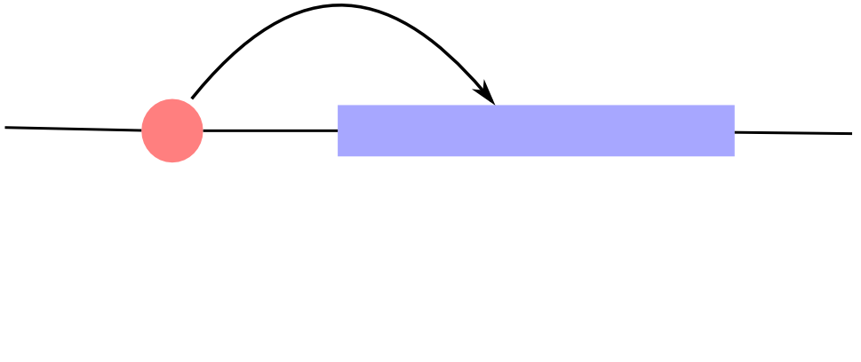
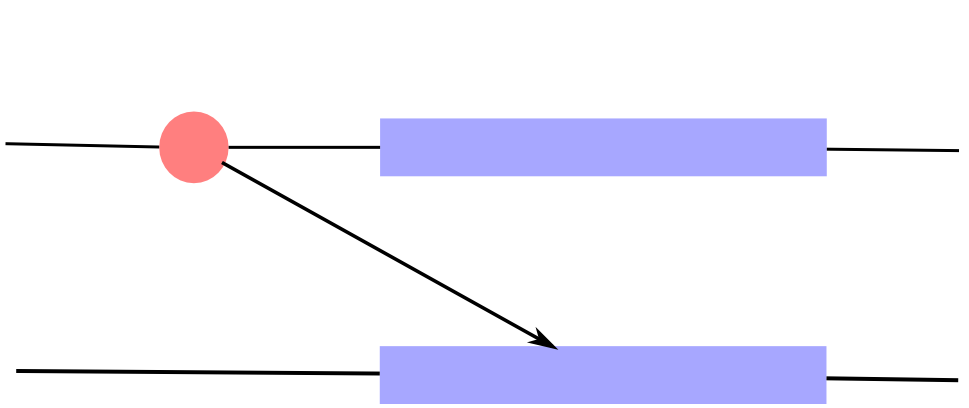
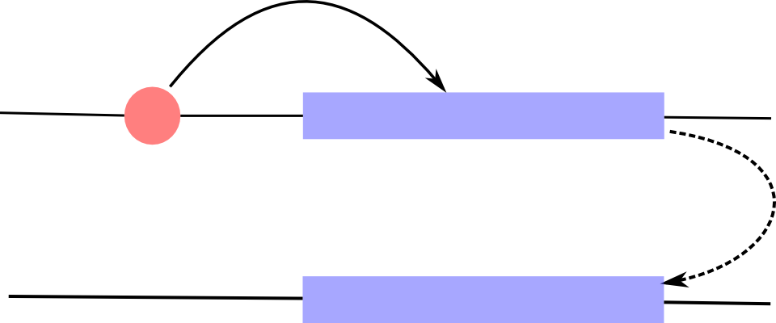
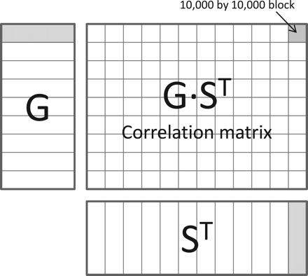

# *Hands-on* : Setup
## Docker image
Make sure you have the latest version of the docker image.

```sh
docker pull humburg/eqtl-intro
```

## Directory structure
* Create a working directory for this course. (`eqtl_course`)
* Within that directory, create two sub-directories
    * `genotypes`
    * `analysis`
* *Mac*: create directories under `/Users/`
* *Windows*: create directories under `C:\Users\`

## Additional data
The docker image contains most of the data. Further genotyping data is available from

```sh
ftp://galahad.well.ox.ac.uk
```
Username: eqtl_course

Download the data and save it into `genotypes`

<div class="notes">
Need to provide password separately.
</div>

## Start the RStudio server    

Windows
  :
  
    docker run -p 8787:8787 
      -v /c/Users/user/eqtl_course/genotpes:/data/genotypes
      -v /c/Users/user/eqtl_course/analysis:/data/analysis 
      humburg/eqtl-intro
    

IP address of the server usually is 192.168.59.103.

Use `boot2docker ip` to check if necessary. 

## Start the RStudio server

Mac
  :
  
    
    docker run -p 8787:8787 
       -v /Users/user/eqtl_course/genotpes:/data/genotypes 
       -v /Users/user/eqtl_course/analysis:/data/analysis 
       humburg/eqtl-intro

IP address of the server usually is 192.168.59.103.

Use `boot2docker ip` to check if necessary. 

## Start the RStudio server    

Linux
  :
  
    docker run -p 8787:8787 
      -v /home/user/eqtl_course/genotpes:/data/genotypes
      -v /home/user/eqtl_course/analysis:/data/analysis
      -e USER=$USER  -e USERID = $UID 
      humburg/eqtl-intro
    

IP address of the server usually is 127.0.0.1 (or *localhost*).
    
## Using RStudio

Access the RStudio interface at *http://yourip:8787*. 

    * Username: rstudio
    * Password: rstudio

## Useful resources

* RStudio [cheat sheets](http://www.rstudio.com/resources/cheatsheets/)

# What are eQTL?
## Quantitative trait loci
QTL are regions of the genome associated with quantitative traits

* height
* BMI
* lung capacity
* ...

## Expression quantitative trait loci {data-transition="none"}
<div class="multicolumn">
<div>
If the trait of interest is the expression of a gene, we talk about eQTL.

* **Associations can be local (*cis*)**
* or distant (*trans*)

</div>
<div>

</div>
</div> 

## Expression quantitative trait loci {data-transition="none"}
<div class="multicolumn">
<div>
If the trait of interest is the expression of a gene, we talk about eQTL.

* Associations can be local (*cis*)
* **or distant (*trans*)**

</div>
<div>

</div>
</div> 

## Expression quantitative trait loci {data-transition="none"}
<div class="multicolumn">
<div>
If the trait of interest is the expression of a gene, we talk about eQTL.

* Associations can be local (*cis*)
* **or distant (*trans*)**

</div>
<div>

</div>
</div> 


# Detecting eQTL -- A simple model
## How do we know whether a locus is associated with the expression of a gene? {data-transition="none"}

<div class="multicolumn">
<div>


</div>
<div>
* **Any given locus contains multiple SNPs.**
* Can determine genotypes for these SNPs in a (large) number of individuals.
* Measure gene expression for genes of interest.
* Assess the evidence that expression varies with genotype.
</div> 
</div>

## How do we know whether a locus is associated with the expression of a gene? {data-transition="none"}

<div class="multicolumn">
<div>

 sample	   snp_1   snp_2   snp_3   ...
--------   -----   -----   -----  -----
sample 1    AA      AA      AB     ...
sample 2    AB      AB      AA     ...
sample 3    AB      BB      AB     ...
...        ...     ...      ...    ...

</div>
<div>
* Any given locus contains multiple SNPs.
* **Can determine genotypes for these SNPs in a (large) number of individuals.**
* Measure gene expression for genes of interest.
* Assess the evidence that expression varies with genotype.
</div> 
</div>

## How do we know whether a locus is associated with the expression of a gene? {data-transition="none"}

<div class="multicolumn">
<div>

 sample	   gene_1   gene_2   gene_3   ...
--------   ------  ------    ------  -----
sample 1    7.3     12.8      6.5     ...
sample 2    10.9    9.6       8.8     ...
sample 3    9.5     10.7      15.1    ...
...         ...     ...       ...     ...

</div>
<div>
* Any given locus contains multiple SNPs.
* Can determine genotypes for these SNPs in a (large) number of individuals.
* **Measure gene expression for genes of interest.**
* Assess the evidence that expression varies with genotype.
</div> 
</div>

## How do we know whether a locus is associated with the expression of a gene? {data-transition="none"}

<div class="multicolumn">
<div id="snp-expr">

</div>
<div>
* Any given locus contains multiple SNPs.
* Can determine genotypes for these SNPs in a (large) number of individuals.
* Measure gene expression for genes of interest.
* **Assess the evidence that expression varies with genotype.**
</div> 
</div>


## Linear additive model
<div class="multicolumn">
<div id="snp-expr">

</div>
<div>
Different alleles of a SNP may exhibit a dosage effect.

* Using the *AA* genotype as baseline, each copy of the *B* allele changes 
  expression by a fixed amount.
* Implies a linear relationship between the mean
  gene expression and the number of *B* alleles.
* Estimating the change in expression due to the *B* allele to quantify 
  the SNP's contribution to gene expression. 
</div> 
</div>

## Linear regression {data-transition="none"}
$$Y = \beta_0 + \beta X + \varepsilon$$

Y
  : Response variable (here: vector of expression values for gene of interest).

X
  : Explanatory variable (here: vector of genotypes (coded as 0, 1, 2) 
    for the SNP under consideration).

## Linear regression {data-transition="none"}
$$Y = \beta_0 + \beta X + \varepsilon$$

$\beta_0$
  : Intercept (here: mean expression for *AA* genotype).

$\beta$
  : Regression coefficient; the effect of X on the mean of Y (here: change in 
    mean gene expression for each copy of the *B* allele).

$\varepsilon$
  : Residuals; the difference between observed values of $Y$ and the estimated
    mean of $Y|X$
    
## Linear regression -- Assumptions

Residuals are

* independent
* normally distributed with mean 0 and constant variance

. . .

It is implied that

* There is a linear relationship between $X$ and $Y$.
* Values of $Y$ for each value of $X$ are normally distributed.
* There is only one source of variation not explained by $X$.


## Linear regression -- Robustness {data-transition="none"}
### Independence of residuals
Lack of independence can produce misleading results.

What could cause this?

## Linear regression -- Robustness {data-transition="none"}
### Constant variance of residuals (homoskedacity)
Violation of this assumption will lead to incorrect p-values and confidence intervals.

## Linear regression -- Robustness {data-transition="none"}
### Normality
* Estimates and their confidence intervals and p-values are fairly robust.
* But beware of long tailed distributions.
* Prediction can become problematic (but we are not interested in that here).

## Linear regression -- Robustness {data-transition="none"}
### Linearity
<div class="left">
If the true relationship between $Y$ and $X$ is non-linear conclusions may be
misleading.

When might this occur with eQTL data?
</div>

## Linear regression -- Robustness {data-transition="none"}
### Linearity
<div class="left">
If the true relationship between $Y$ and $X$ is non-linear conclusions may be
misleading.

When might this occur with eQTL data?
</div>
<div class="right">

</div>

# *Hands-on* : Simple linear regression    
## Data

Genotypes
  : */data/simulated/sim_genotypes.tab*

Gene expression
  : */data/simulated/sim_expression1.tab*
    
## Warm-up

> #. Load the data into R.
> #. How is the data formatted?
> #. Determine minor allele frequencies.

<div class="notes">

```r
geno <- readr::read_tsv("/data/simulated/sim_genotypes.tab")
expr <- readr::read_tsv("/data/simulated/sim_expression1.tab")

maf <- colMeans(geno[-1])/2
```
</div>

##  Plotting the data
* Choose a SNP/gene pair (snp_1 / gene_1, snp_2 / gene_2, ...)
* Create a plot showing gene expression by genotype for this pair.

<div class="notes">
Assign SNP/gene pairs to participants to ensure each is handled at least once.

```r
library(ggplot2)
genoLong <- tidyr::gather(geno, snp, genotype, -sample)
exprLong <- tidyr::gather(expr, gene, expression, -sample)
dataLong <- cbind(genoLong, exprLong["expression"])
dataLong$genotype <- as.factor(dataLong$genotype) 
ggplot(dataLong, aes(genotype, expression)) +
		geom_jitter(colour="darkgrey", 
				position=position_jitter(width=0.25)) +
		geom_boxplot(outlier.size=0, alpha=0.6, fill="grey") + 
		facet_wrap(~snp) + theme_bw()
```
</div>

## Fitting a simple linear regression

#. Fit a simple linear regression for the SNP/gene pair of your choice.
#. Compute the 95% confidence interval for the genotype effect.

<div class="notes">
Collect results from participants into a file and load into R.

Code fit all models is below.

```r
fit <- mapply(function(e, g) lm(e ~ g), 
		expr[-1], geno[-1], SIMPLIFY=FALSE)
betaHat <- sapply(fit, coef)[2,]

ci <- sapply(fit, confint, "g")
rownames(ci) <- c("lower", "upper")
```
</div>

## Examining the results

#. Create diagnostic plots.
#. Plot estimated genotype effects by minor allele frequency.

<div class="notes">
Display R's build-in diagnostics by plotting the `fit` object.

The true SNP effect is 1.5

```r
estimates <- data.frame(estimate=betaHat, t(ci), maf=maf)
fig <- ggplot(estimates, aes(x=maf)) +  
		geom_hline(yintercept=0, linetype="longdash") + 
		geom_errorbar(aes(ymin=lower, ymax=upper)) +
		geom_point(aes(y=estimate))  + theme_bw()
fig <- fig + geom_hline(yintercept=1.5)
```
</div>

## Interlude: p-values

* After estimating model coefficients we can test them for departure from 0.
* We are interested in identifying SNPs with non-zero coefficients.
* The strength of the evidence that the true coefficient is non-zero is often
  gauged by the resulting p-value.
* How should p-values be interpreted?

<div class="notes">
The p-value is the probability of observing an effect at least as extreme as
the one in the sample data if the null hypothesis is true.

P-values relate to how likely it is to observe the data under pre-specified
conditions **not** to how likely the null hypothesis is.

Use p-values as a guide to identify potentially interesting results, not as a definitive
statement of which findings are real.

Consider other evidence, especially estimates of effect sizes and their confidence intervals.
</div>

# Detecting eQTL -- Not *that* simple
## Additional sources of variation

* Gene expression is subject to many sources of variation.
* A model with a single SNP as explanatory variable is unlikely to be sufficient.

. . .

Use multiple regression to obtain better estimates of SNP effects.

## Multiple regression
$$Y = \beta_0 + \sum_{i=1}^n \beta_i X_i + \varepsilon$$ 

* Similar to simple linear regression but incorporates multiple 
  explanatory variables.
* $\beta_i$ are interpreted as "change of $Y$ due to a unit change in $X_i$ when
  *all other explanatory variables are held constant*".
  
> * Explanatory variables are assumed to be uncorrelated with each other.

# *Hands-on* : Covariates
## Data

Genotypes
  : */data/simulated/sim_genotypes.tab*

Gene expression
  : */data/simulated/sim_expression2.tab*
  
Covariates
  : */data/simulated/sim_covariates.tab*
  
<div class="notes">
geno <- readr::read_tsv("/data/simulated/sim_genotypes.tab")
expr <- readr::read_tsv("/data/simulated/sim_expression2.tab")
covar <- readr::read_tsv("/data/simulated/sim_covariates.tab")
</div>

## Plotting the data
Create a plot of gene expression by genotype for you SNP/gene pair of choice.

How does this compare to the plot from the previous exercise.

<div class="notes">

```r
library(ggplot2)
genoLong <- tidyr::gather(geno, snp, genotype, -sample)
exprLong <- tidyr::gather(expr, gene, expression, -sample)
dataLong <- cbind(genoLong, exprLong["expression"])
dataLong$genotype <- as.factor(dataLong$genotype) 
ggplot(dataLong, aes(genotype, expression)) +
		geom_jitter(colour="darkgrey", 
				position=position_jitter(width=0.25)) +
		geom_boxplot(outlier.size=0, alpha=0.6, fill="grey") + 
		facet_wrap(~snp) + theme_bw()
```

There is very little evidence of a SNP effect in these plots.
</div>
    
## Simple linear regression
Repeat the simple linear regession analysis with these data.

#. Fit a model for one of the SNP/gene pairs
#. Create diagnostic plots
#. Compute the confidence interval for the coefficient

How does this compare to the result from the previous analysis?

<div class="notes">

```r
simpleFit <- mapply(function(e, g) lm(e ~ g), 
		expr[-1], geno[-1], SIMPLIFY=FALSE)
simpleBetaHat <- sapply(simpleFit, coef)[2,]
simpleCI <- sapply(simpleFit, confint, "g")
rownames(simpleCI) <- c("lower", "upper")
```

Plot all results:

```r
maf <- colMeans(geno[-1])/2
estimates <- data.frame(estimate=simpleBetaHat, t(simpleCI), maf=maf)
ggplot(estimates, aes(x=maf)) + geom_hline(yintercept=1.5) + 
		geom_hline(yintercept=0, linetype="longdash") + 
		geom_errorbar(aes(ymin=lower, ymax=upper)) +
		geom_point(aes(y=estimate))  + theme_bw()
```
Note that the true SNP coefficient is still 1.5 but estimates are
considerably worse.
</div>

## Multiple linear regression
#. Use the first five variables contained in the covariates file as 
  covariates in your model.
#. Create diagnostic plots
#. Compute the confidence interval for the coefficient

<div class="notes">

```r
covarFit <- mapply(function(e, g, var) lm(e ~ g + var), 
		expr[-1], geno[-1], 
		MoreArgs=list(as.matrix(covar[2:6])), SIMPLIFY=FALSE)
covarBetaHat <- sapply(covarFit, coef)[2,]
covarCI <- sapply(covarFit, confint, "g")
rownames(covarCI) <- c("lower", "upper")
```

May also want to try including all 20 variables.
</div>

# Covariates -- Choose wisely
## (Multi)-colinearity
If $X_i$ and $X_j$ are correlated the estimates of $\beta_i$ and
$\beta_j$ will be biased. Several issues may occur:

* All the variance in $Y$ due to $X_i$ and $X_j$ is wholly attributed to
  one of the variables (say, $X_i$). 
    
    * Results in over estimation of $\beta_i$ and under estimation of $\beta_j$
* Estimates for both $\beta_i$ and $\beta_j$ are too low because all of the variance
  is explained by the other variable that is *held constant*.
* No sensible interpretation for $\beta_i$ and $\beta_j$.
* Model fitting may fail.

## Dealing with colinearity

* Check correlation between explanatory variables.
* Check variance inflation factor (VIF).
* Choose only one from each group of correlated variables.

Only really need to worry about variables of interest for
downstream analysis.

# If only we knew -- Covariates for real data
## Limited information

* Real data comes with varying amounts of additional information.
    * Sex and age are common
    * May have detailed phenotyping data
* Some variables will have big impact on gene expression
* Won't have information on all relevant variables.

## Use the data

* We don't have to know what the (non-genetic) sources of variation are
  as long as we can account for them.
* Dimensionality reduction techniques can identify major directions of variation
  from the data.
  
## Principle component analysis

* Transforms the data into set of (linearly) uncorrelated variables (principle components).
* Principle components (PCs) are ordered by the proportion of variance they explain.
* Can reduce the dimensionality of a dataset by considering only the first $k$ PCs.

How does that help us?

## Accounting for unknown sources of variation

* The major sources of variation in gene expression data are (usually) not genetic.
* Can remove non-genetic sources of variation by including the3 first $k$ PCs into
  the model.

## Practical considerations

* Not obvious how many PCs to include in model.
* Need to look out for PCs that *do* correlate with genotype.

. . .

* Beware of data formatting issues.
* Data should be centred and scaled prior to PCA.

# *Hands-on* : Dealing with real data

## Data

Gene expression
  : */data/monocytes/expression/ifn_expression.tab.gz*
  
Genotypes
  : */data/genotypes/genotypes.tab.gz*  
  (downloaded earlier) 

Subset of data published in  
Fairfax, Humburg, Makino, *et al.*  
**Innate Immune Activity Conditions the Effect of Regulatory Variants upon Monocyte 
Gene Expression**. Science (2014). doi:[ 10.1126/science.1246949](http://doi.org/10.1126/science.1246949).

## Brief look at the data

* Load the data and examine it 

<div class="notes">

```r
geno <- readr::read_tsv(file("/data/genotypes/genotypes.tab.gz"))
expr <- readr::read_tsv(file("/data/monocytes/expression/ifn_expression.tab.gz"))
```

Note that these files have variables in rows and samples in columns.  
Look at the data.frames biefly, maybe plot some gene expression data
if there is time. 
</div>

## Interlude: Data processing

* These data have alredy been QC'd and processed.
* When dealing with raw data extensive QC is required for genotyping and expression data.
* Gene expression data also needs to be normalised across samples.
* Can be a lengthy process but is crucial for the quality of results.

## PCA 101

* Compute principle components of gene expression data.
* Create a plot of the variances for the first 10 PCs.
* How much of the total variance is explained by the first 10 PCs?

<div class="notes">

```r
pca <- prcomp(t(expr[-1]), center=TRUE, scale = TRUE)
pc <- pca$x
```

```r
plot(pca, npcs=10)
```

Since the data were scaled prior to the PCA the total variance is the same as the 
number of probes. The variance accounted for by each component is available through 
the `sdev` field of the `prcomp` return value.

```r
sum(pca$sdev[1:10]^2)/nrow(expr)
```
</div>

## Model fitting with PCA covariates

* Model the expression measured by probe 3710685 as a function of SNP 
  rs4077515 and the first 10 PCs.
* Create a plot of gene expression by genotype with the effect of the PCs
  removed.
* How does this compare to the simple linear regression model for
  this SNP/gene pair.  

<div class="notes">
To make our life a bit easier we collect all the relevant data into a single data.frame.

```r
data <- data.frame(probe=unlist(subset(expr, Probe=="3710685")[-1]), 
        rs4077515=unlist(subset(geno, id=="rs4077515")[-1]), pc[,1:10])
```        

```r
pcFit <- lm(probe ~ ., data=data)
summary(pcFit)
```

Simple model:

```r
simpleFit <- lm(probe ~ rs4077515, data=data)
summary(simpleFit)
```

Plotting

```r
library(ggplot2)
corrected <- data$probe - rowSums(coef(pcFit)[-(1:2)]*data[, 3:12])
corrected <- data.frame(expression=corrected, genotype=factor(data$rs4077515))
ggplot(corrected, aes(genotype, expression)) +
        geom_jitter(colour="darkgrey", position=position_jitter(width=0.25)) +
        geom_boxplot(outlier.size=0, alpha=0.6, fill="grey") + theme_bw()
```
</div>

# Large scale eQTL analysis
## Genome-wide analysis

* We don't just want to analyse a single SNP/gene pair ...
* or even all SNP associations with a single gene

>* We want to study *all* SNP/gene pairs.
>* (but may restrict this to local associations). 

. . .

This is computationally intensive and may be very time consuming.

. . .

Need to be clever about how we do this.

## Fast model fitting with Matrix-eQTL
[Matrix-eQTL](http://www.bios.unc.edu/research/genomic_software/Matrix_eQTL/)
strategies to reduce run time:
<div class="multicolumn">
<div>

* Required test statistic can be expressed
  in terms of the correlation between SNP and gene expression.
* Use efficient matrix multiplications to compute the correlations.
* Computing p-values is expensive, only do this for SNP/gene pairs 
  that are sufficiently interesting.

</div>
<div>

</div>
</div>

<div class="notes">
For simple linear regression:
$$
t = \sqrt{n-2}\frac{r}{\sqrt{1-r^2}}
$$
Can precompute p-value threshold based on $r^2$
</div>

## Correcting for multiple testing

* A genome-wide analysis requires estimating millions of effect sizes.
* For an individual SNP/gene pair the p-value of the genotype coefficient may be
  a useful to gauge whether it is likely to be relevant.
* Interpreting p-values becomes more difficult if millions of them have to be considered.

## False discovery rate

* Instead of considering each test individually try to control the number of
  tests that are incorrectly interpreted as indicating a true departure from
  the null hypothesis.
* Adjust p-values such that the resulting value is an estimate of the proportion
  of false positives obtained at a given threshold.
* Matrix-eQTL uses the Benjamini-Hochberg procedure.


# *Hands-on* : Scaling it up
## Data

## Running Matrix-eQTL

## A command-line interface

 
# Interpreting results
## Still just a pile of data

* The initial analysis can produce a long list of SNP/gene associations.
* Without further analysis these are not particularly helpful.
* How can we identify particularly interesting results?
* How can we assign biological meaning to the list of associations?

## External data sources

* A lot of genomic datasets and derived annotations are available.
* Link SNPs to functional annotations using
    * [GWAS catalogue](http://www.genome.gov/gwastudies/)
    * [Blueprint](http://www.blueprint-epigenome.eu/)
    * [ENCODE](https://www.encodeproject.org/)
* Visualise SNPs in genomic context, e.g. using
  [UCSC genome browser](http://genome-euro.ucsc.edu/index.html) 
